# Lab 2: Vulnerabilities in web applications

## Contents

- 1. Objective
- 2. How to install
- 3. Exercises
  - 3.1. Parameter Tampering
    - 3.1.1. Hidden fields
    - 3.1.2. e-mail not validated
    - 3.1.3. Avoid validations on the client side
    - 3.1.4. Fail Open Authentication Scheme
  - 3.2. Session administration and authentication
    - 3.2.1. Authentication using cookies
  - 3.3. Injection Flaws
    - 3.3.1. SQL Injection
    - 3.3.2. JSON Injection
- 4. References

## 1. Objective

Vulnerabilities in web applications are responsible for most of the security
violations in computer networks. Every time more often, the attacks are
addressed to applications such as Internet shopping, web forms, as well as the
authentication and access points to protected web pages and dynamic contents
from linked databases with transactions and information requests. When we talk
about web application vulnerabilities we are not talking about operating system
or HTTP server vulnerabilities (version update, patches, etc.) but about the
vulnerabilities of the software on top of them. Such vulnerabilities are
directly related to the logic, code scripting and content of the web
application. Being able to detect such vulnerabilities provides us with more
security as well as to be able to provide more control and quality to our
software products. The objective of this session is to study some of the main
vulnerabilities found in web applications, study some basic ways to perform
attacks and understand the origin of such vulnerabilities and how to be able to
avoid them. We will use the following applications for this session:

- **WebGoat** is a J2EE application developed by OWASP (The Open Web Application
  Security Project) and based on Tomcat. It is an insecure application, and it
  is basically its purpose. The objective is to use it as an introduction to
  different attacks directed to web applications (test environment). It has
  different lessons that provide us with help and information to understand and
  to be able to overcome them.
- **WebScarab** is a framework to analyze web applications developed by OWASP.
  It uses HTTP and HTTPS, and it can be used as a proxy to study a web page
  requests and responses, review and modify them before they get to the client
  or the server.

## 2. How to install

1. Download WebScarab:

   ```bash
   curl -o webscarab.jar -sL \
     https://github.com/fib-gei-si/webgoat_legacy/raw/master/webscarab.jar
   java -jar webscarab.jar
   ```

2. Run WebGoat in Podman:

   ```bash
   podman run --name webgoat --rm -p 8080:8080 \
     ghcr.io/fib-gei-si/webgoat_legacy
   ```

3. Configure Firefox:
   a. Open `about:config` writing it in the address bar and set
      `network.proxy.allow_hijacking_localhost=true` to allow proxy to
      localhost and `app.update.auto=false` to disable automatic updates.

      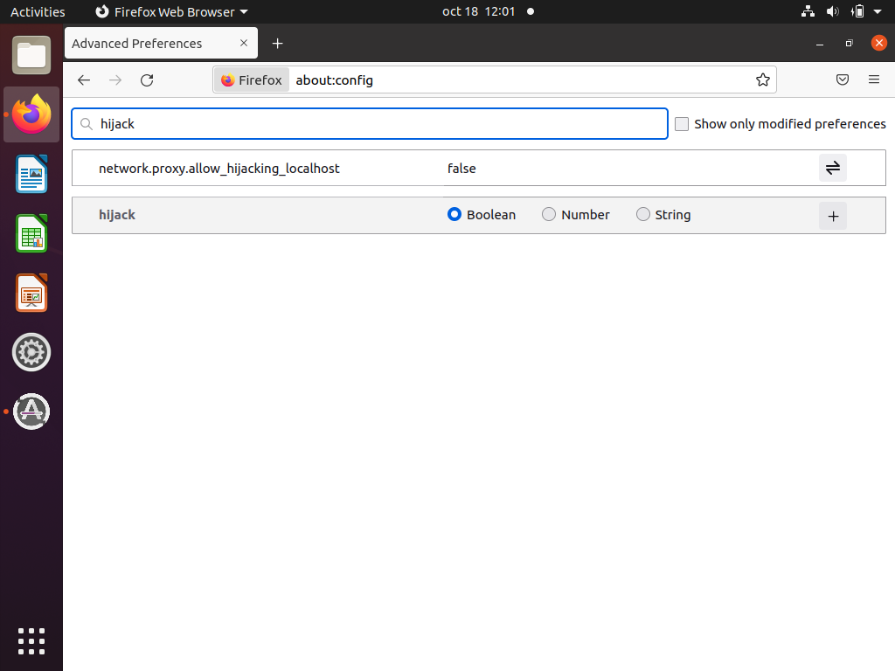

   b. Open `about:preferences` writing it in the address bar to open the
      general settings. Type "network" in the search bar to open "Network
      Settings" to manually configure the proxy option as shown in the figure.
      Observe that the field "No Proxy for" doesn't have either "127.0.0.1" nor
      "localhost".

      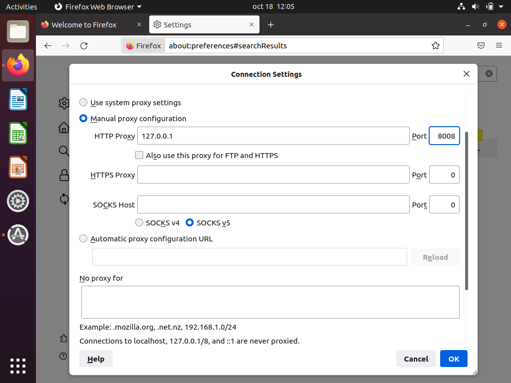

4. Open <http://127.0.0.1:8080/webgoat/attack> in the browser (user/pass:
   guest/guest).

## 3. Exercises

The vulnerabilities that we are going to see are:

- **Parameter Tampering:** how to obtain additional information from web
  applications and modify the client's generated requests or server responses
  to be able to perform the attack.
- **Weak session identification:** we will see the dangers of weak
  authentication, and in this case, how to impersonate another user by means of
  a session cookie.
- **Injection Flaws:** it is a vulnerability found at the input data validation
  of a database associated with a web application. The origin is the incorrect
  filtering of variables used in the application code.

### 3.1. Parameter Tampering

We will see the danger of not validating input parameters on a Web application
or doing a poor or incorrect validation. On "Parameters tampering" we will find
four exercises:

#### 3.1.1. Hidden fields

Access to WebGoat's lesson "Exploit Hidden Fields" in "Parameter Tampering".
Its goal is to buy from a web page for a lower price.

Observing the web page, we can see that the field "Price" can't be modified.
Try several times "Update chart" or "Purchase" or observing the code, clicking
"Show Java" to modify the product's price. Have you found anything?

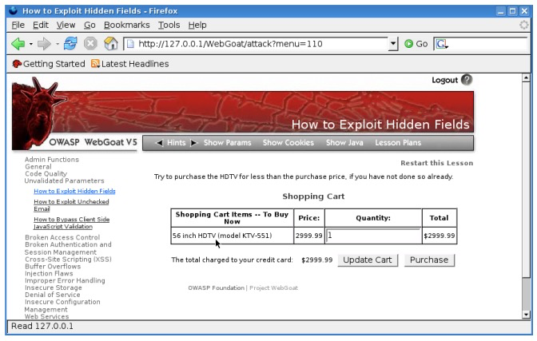

Let's now watch the request sent to the server when we try to buy. Follow the
steps:

- Go to WebScarab and tick "Intercept Requests" inside the "Intercept" tab.

  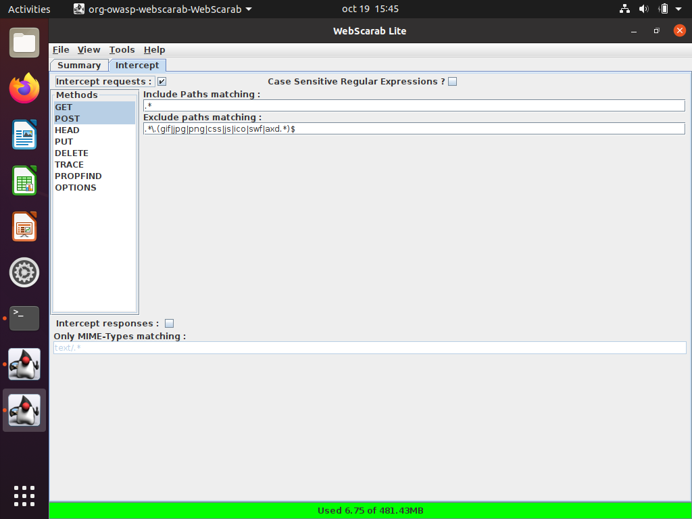

- Once the requests' interception has been activated, go back to WebGoat and
  try to buy by clicking on "Purchase".

- You will then see a new WebScarab window popping up with the intercepted
  request. If we take a look at the tab "URLEncoded" we will find variables
  (QTY, SUBMIT, Price). One of the variables refer to the purchase price, try
  to modify the price at column "Value", disable the requests' interception
  (clicking again on "Intercept Requests") and click on "Accept Changes".

  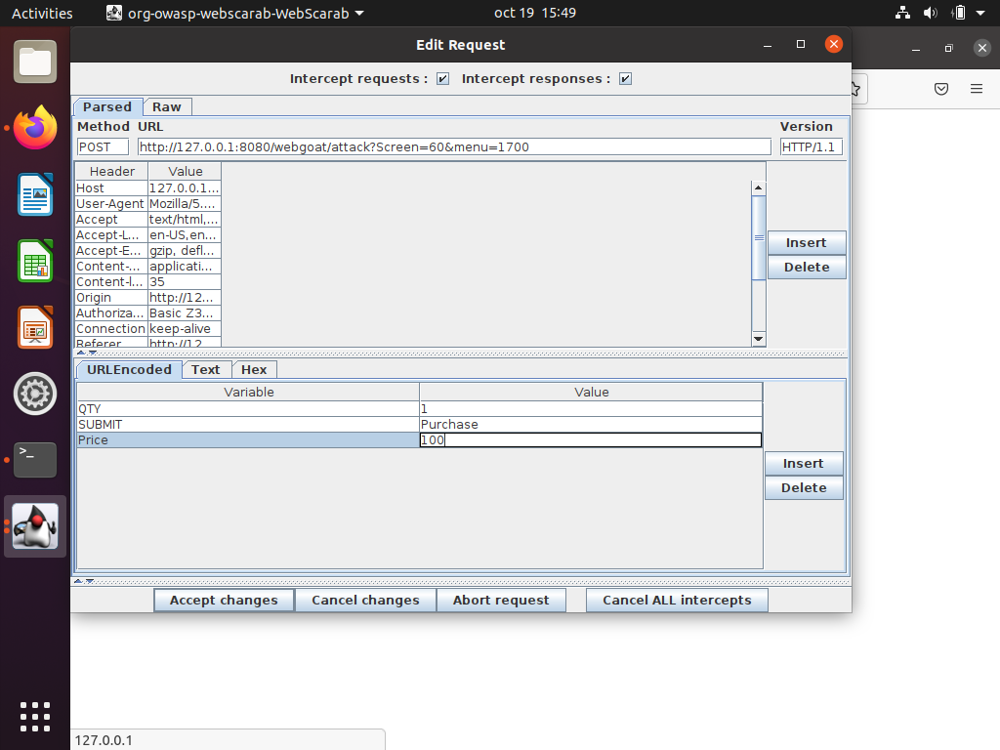

#### 3.1.2. e-mail not validated

Go to WebGoat lesson "Exploit unchecked mail" in "Parameter Tampering". Now the
goal is to be able to change the e-mail address where the comments typed at the
web page are sent. Enter some comments and see the code by clicking on "Show
Java" to be able to modify the e-mail address. Have you found anything?

- Type a malicious script like the following one into the comments field and
  send:

  ```javascript
  <script>alert("XSS")</script>
  ```

- Observe that you are able to add your own script and execute whatever you
  want. Now, let's change the e-mail address field. This can be accomplished by
  intercepting the request with WebScarab and changing the hidden field "to"
  from `webgoat.admin@owasp.org` to `alumne@fib.upc.edu` (don't worry, no email
  is actually sent during this test).

  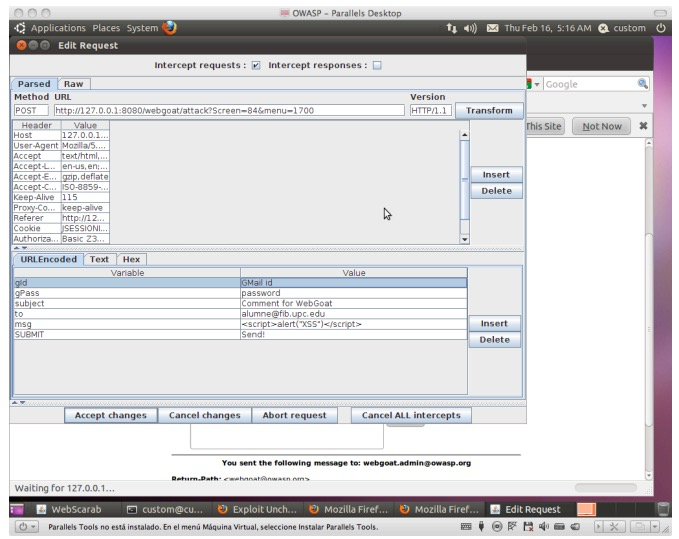

#### 3.1.3. Avoid validations on the client side

Go to WebGoat lesson "Bypass Client Side JavaScript Validation" in "Parameter
Tampering". The goal is to avoid validation implemented on the client side of
the application.

This web page sends seven values to the web server that need to match regular
expressions validated locally. Try introducing correct and incorrect values on
every field and send them clicking on "Submit" or observing the code clicking
on "Show Java" to be able to find the code implementing the fields' validation.
Have you found anything?

What would happen if we sent incorrect values in all the fields? For instance,
a dash (-).

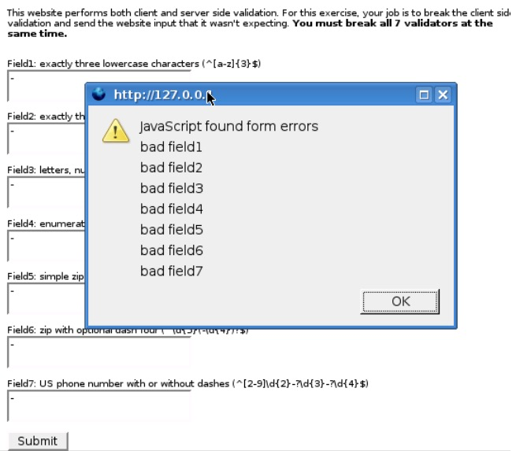

Data is being validated at the client side, and we can't send it to the server.
Looking at the code, you can find the section implementing the validation:

```javascript
if (!pattern1.matcher(param1).matches()) {
    err++;
    msg += "<BR>Server side validation violation: You succeeded for Field1.";
}
if (!pattern2.matcher(param2).matches ()) {
    err++;
    msg += "<BR>Server side validation violation: You succeeded for Field2.";
}
...
if (err > 0) {
    s.setMessage(msg);
}
```

This code is downloaded when requesting the web page. Let's try to skip the
validation.

We need to modify WebScarab configuration to be able to intercept server's
responses. On tab Intercept, check "Intercept Responses" and verify that
"Intercept Requests" is disabled. Now reload the browser's page to issue a new
request. You will see a new WebScarab window with the intercepted response. If
we click on the "Raw" tab from the lower half window we will be able to see the
server's response and there we will find the code to validate the fields that
we want to avoid.

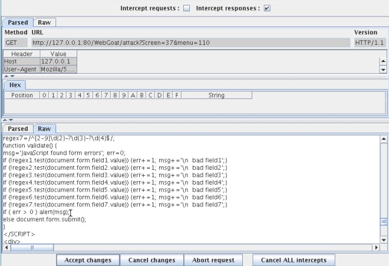

Edit the validate code, forcing the error count to 0 by adding `err=0;` before
`if (err>0) alert(msg);`. Uncheck "Intercept responses", click on "Accept
Changes", go back to the web page and click "Submit" to send incorrect data to
the server. We have been able to avoid the client's validation and to send
incorrect information to the server.

Open the browser console (right click → Inspect → Console) and paste the
snippet to obtain the SHA256 from the message in red that appears when you pass
the exercise. Otherwise use an online tool like to get the SHA256 digest by
copying and pasting the text in red.

#### 3.1.4. Fail Open Authentication Scheme

Go to WebGoat lesson "Fail Open Authentication Scheme" in "Improper Error
Handling". Try solving the lesson bypassing the authentication check by
generating an uncaught error in the server.

- Enter username "webgoat" and click "Login".

  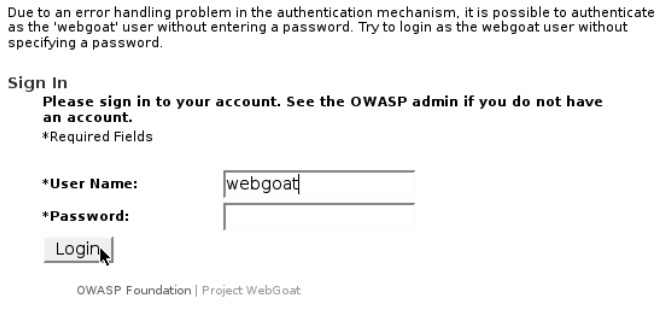

- Intercept the request with WebScarab.
- Click on the variable "Password" and click "Delete". Click "Accept changes".

You are now "authenticated" as WebGoat.

### 3.2. Session administration and authentication

#### 3.2.1. Authentication using cookies

We'll see now how applications use cookies to maintain session information and
how that information can be used to establish a session for a different user
without having its credentials.

Go to WebGoat lesson "Spoof an Authentication Cookie" in "Session Management
Flaws". The goal is to be able to establish a session as user "Alice" without
having her credentials.

Try authenticating as "webgoat/webgoat" and "aspect/aspect" reloading the
screen to observe how the web page uses the cookie to validate and maintain the
session. Watch the code, clicking on "Show Java" to be able to establish a
session as user "Alice". Have you found anything?

Let's take a look at the mechanism used to authenticate using the cookie:

- Log in as "webgoat".

  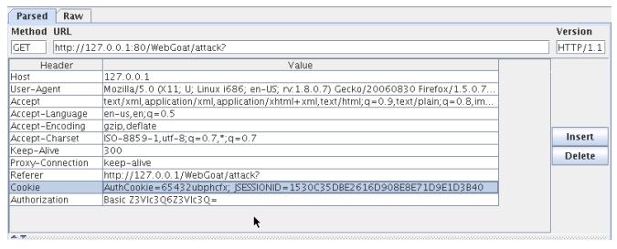

- Check the WebScarab "Intercept Request" box and click "Refresh". You will see
  a new window with the request; observe the cookie's value. Uncheck "Intercept
  Requests" and click "Accept Changes".

  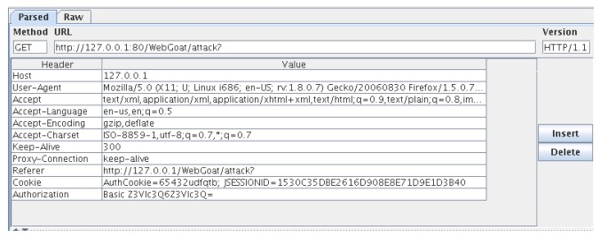

- Do the same for the user "aspect" observing the value of the cookie; compare
  it with the one for the user "webgoat".
- Repeat the same process several times, observing the value of the cookie for
  each user.

The value of the variable "AuthCookie" for each user is always the same.
Therefore we can think that if we find the logic that generates that value we
can try to modify the cookie to simulate a session for another user. Let's
study each value:

| User    | AuthCookie  |
| ------- | ----------- |
| webgoat | 65432ubphcfx |
| aspect  | 65432udfqtb  |
| Alice   | 65432?????   |

We can see that the variable "AuthCookie" always begins with "65432", we will
then concentrate on the variable part.

It looks like the number of characters of the username is directly related to
the generated code:

- webgoat 7 characters → upbhcfx 7 characters
- aspect 6 characters → udfqtb 6 characters
- alice 5 characters ... we may then think that the code will have 5 characters

Let's now try finding some relationship amongst the characters: The code
generated for both users begins with "u" but the username doesn't begin with
the same character. But we see that both end in "t". Reversing the order:

| User    | AuthCookie |
| ------- | ---------- |
| taogbew | ubphcfx    |
| tcepsa  | udfqtb     |

Now, we only need to observe the characters a bit longer to discover that each
character corresponds to one of the characters of the username in the
"AuthCookie" alphabet. That's a variant of the Caesar enciphering, classic and
very basic method where a character is replaced by another one, with a
bijective correspondence.

```
t->u, a->b, o->p, g->h, b->c, e->f, w->x
t->u, c->d, e->f, p->q, s->t, a->b
```

Therefore, to generate the code for user "alice":

| User    | AuthCookie  |
| ------- | ----------- |
| webgoat | 65432ubphcfx |
| aspect  | 65432udfqtb  |
| Alice   | 65432fdjmb   |

Now, let's send the server the modified value of "AuthCookie": start a session
with for user "webgoat" or "aspect", check WebScarab's "Intercept Requests" and
click "Refresh". On the new WebScarab window containing the request, modify the
value for "AuthCookie" using the one we have calculated, uncheck "Intercept
Requests" and click on "Accept Changes".

You can now see a page that is greeting user "alice".

### 3.3. Injection Flaws

#### 3.3.1. SQL Injection

We are going to study how to insert SQL sentences inside a previously written
query in order to manipulate the correct procedures of a given application.

Go to WebGoat lesson "String SQL Injection" (not "LAB: SQL Injection") in
"Injection Flaws". Its goal is to obtain a listing of the credit cards stored
in a database. Type "Smith" as a parameter and try other values. Observe the
results and study how the SQL sentence providing the listing is modified. See
that the query is waiting for a value to be entered and then used.

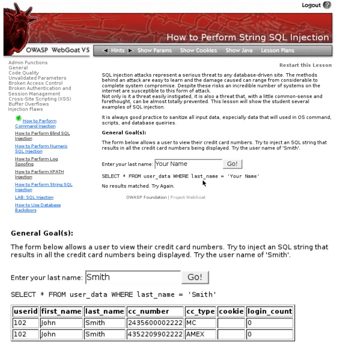

What if we type two quotes without any value?

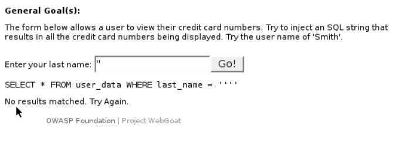

The SQL sequence is correct and returns no value. What if we type just one
quote?

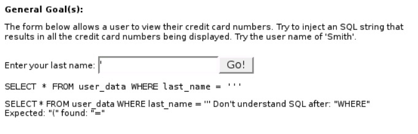

Now the SQL syntax is not correct: it requires a quote at the beginning of a
string and another one at the end. We must then find a correct SQL sentence
that is always true. Enter this text for "last_name" and execute the query by
clicking on "Go!"

```sql
FIB' or '1' = '1
```

We can close the first quote with any value and then add an expression that
always is true (`"1"="1"`). We need to remember that a quote is added at the
end. The Boolean OR operator will make the trick, returning all the values of
the table.

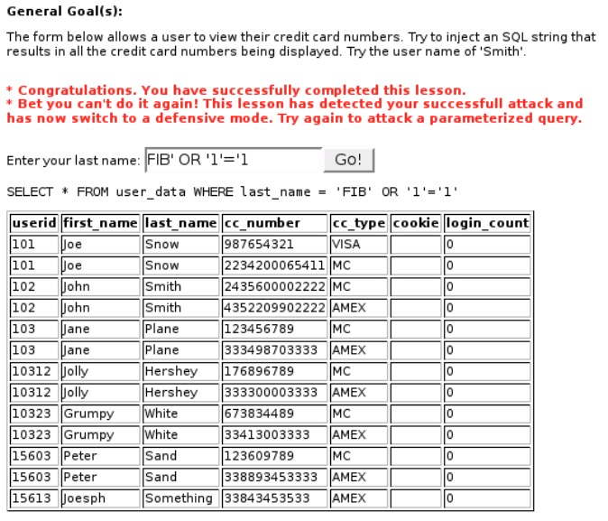

We have finally achieved to list all the values of the customer's credit cards
stored in the database.

#### 3.3.2. JSON Injection

Go to WebGoat lesson "JSON Injection" in "AJAX Security". Its goal is to try to
get the cheaper direct (without stops) flight between Boston (BOS) and Seattle
(SEA).

Like with the previous lessons, you need to manipulate the HTTP Response using
WebScarab.

- Examine the normal flow by entering the airport code BOS and SEA and
  intercept the HTTP Response in WebScarab.

  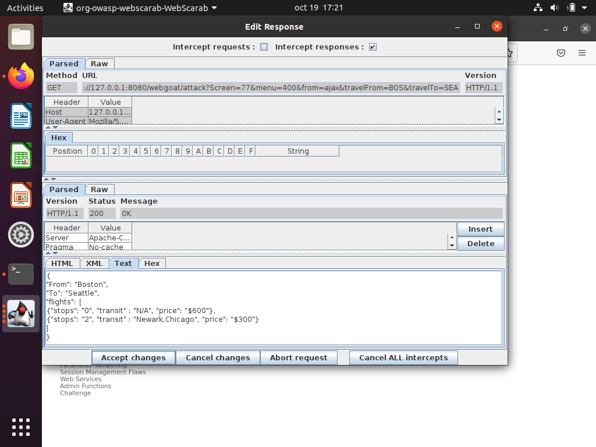

- Change the price for the expensive flight of $600 to $60 and click "Accept
  changes".
- Select the flight with no stops and the updated price and click "Submit".

  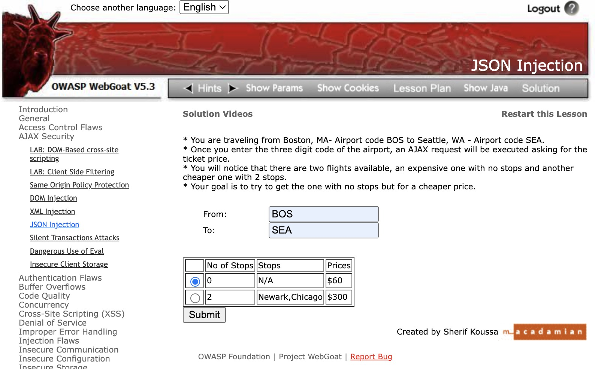

We managed to purchase the cheapest flight.

## 4. References

- OWASP Project: <http://www.owasp.org>
- OWASP Project at Sourceforge: <http://sourceforge.net/projects/owasp>
- Web Application Security Consortium (WASC): <http://www.webappsec.org>
- Common Vulnerabilities and Exposures (CVE): <http://www.cve.mitre.org>
  - <http://www.faqs.org/rfcs/rfc2660.html>
  - <http://www.faqs.org/rfcs/rfc2616.html>
  - <http://www.faqs.org/rfcs/rfc1945.html>
- Secure Coding: Principles & Practices: <http://www.securecoding.org/>
