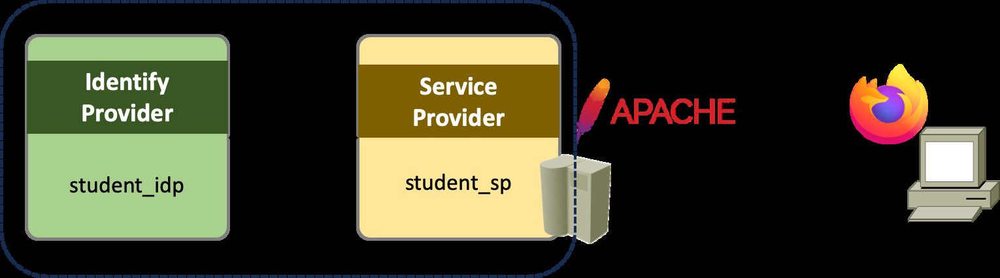
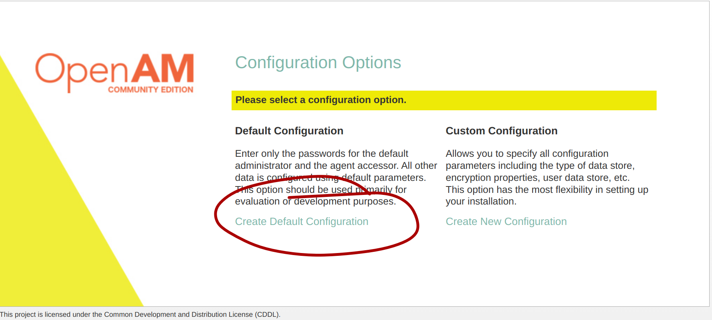
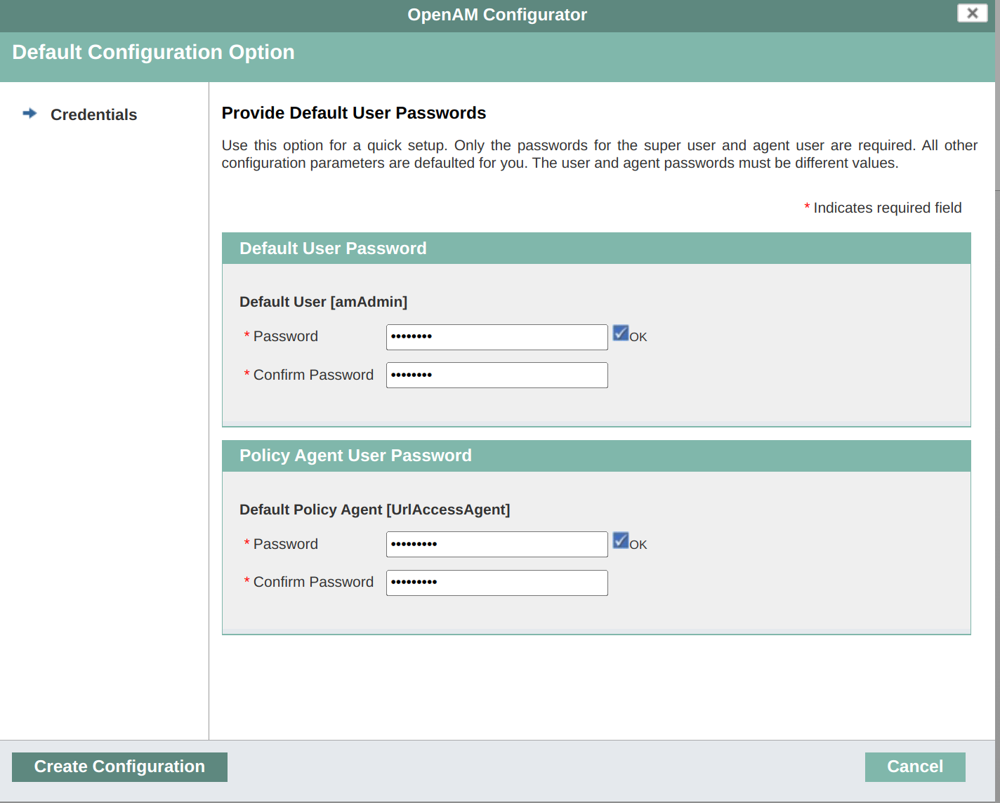
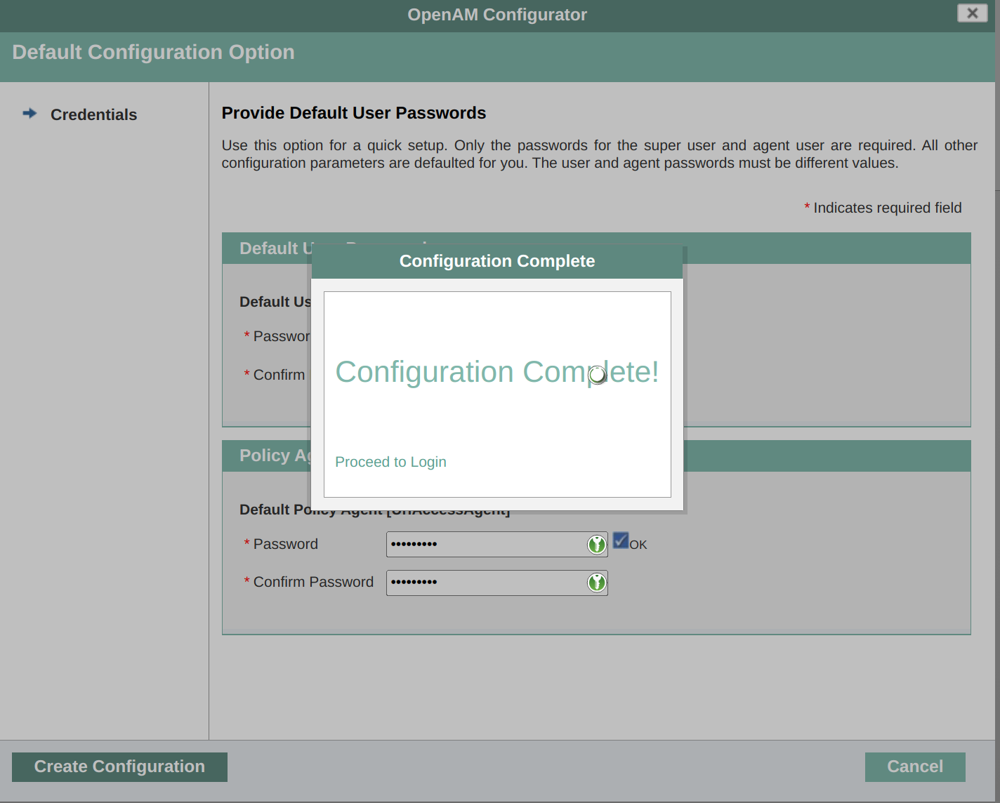
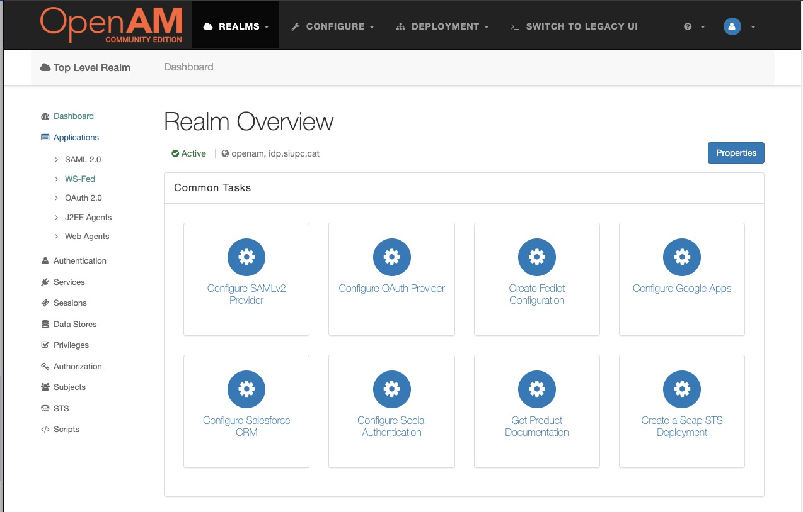
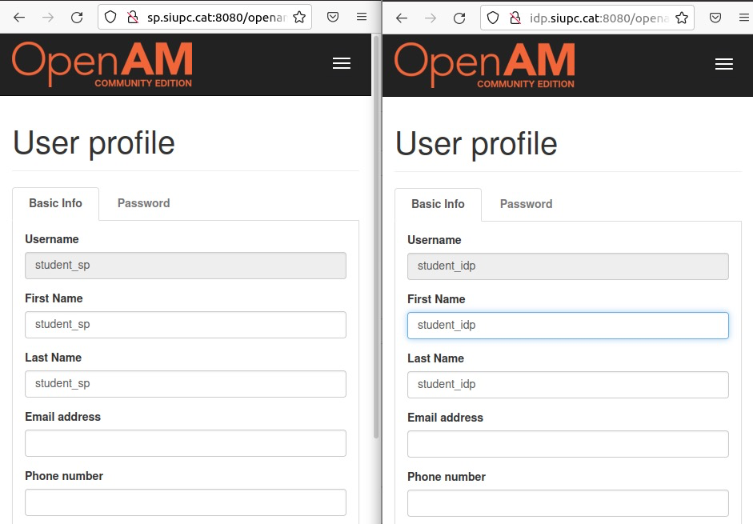
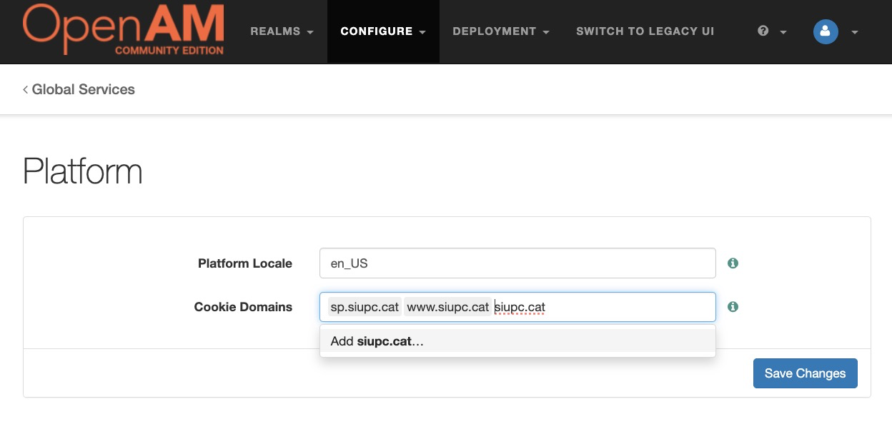
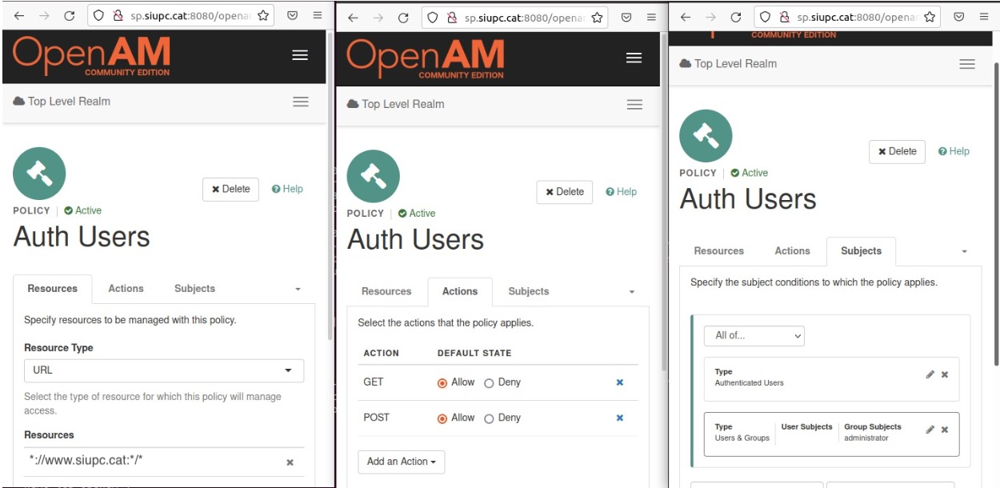
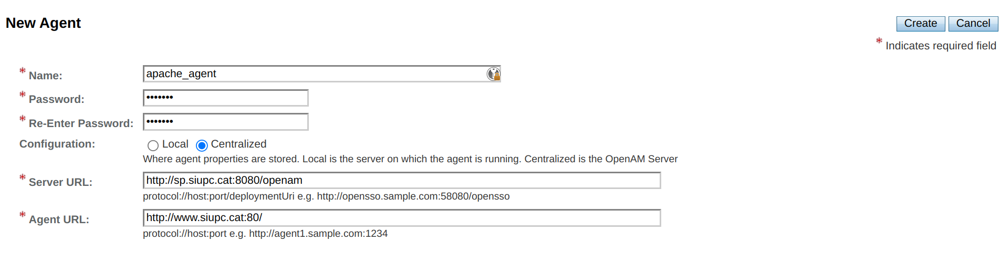

# Lab 3: Federated authentication and authorization

## Contents

- Objective
- How to install
  - Configure Identity Provider
  - Configure Service Provider
  - Link the accounts
- Exercise
- References

## Objective

When dealing with distributed scenarios, it is common to use federated
authentication, this allows to delegate all the authentication tasks to a third
party. In this lab, we will install and configure a SAML authentication system
in a federated environment.

The goal of this lab is to configure a fully working federated environment using
a Service Provider with Apache and an Identity Provider. To do so, we will use
OpenAM from ForgeRock, which is a community driven implementation. For this to
work, we will have to simulate ownership of a public domain. The domain we will
be using is `siupc.cat`.



## How to install

**IMPORTANT:** Before starting, make sure that you don't have any container
running on docker:

```bash
sudo docker ps
```

If there is, stop and delete it by running:

```bash
sudo docker stop [container name] && sudo docker rm [container name]
```

1. Download and run the base image "Linux Ubuntu LTS 64 bits" from
   <https://softdocencia.fib.upc.edu/software/> (user/pass: alumne/sistemes)

   The rest of the steps assume you are using the Virtual Machine.

2. Install docker, as we will use it to simulate a little network:

   ```bash
   sudo apt update && sudo apt install -y docker.io
   ```

   **Tip:** If you want to manage Docker as a non-root user, you need to execute
   the following command and restart the VM: `sudo usermod -aG docker $USER`

3. Create the docker network that will be used by the containers to talk to each
   other:

   ```bash
   sudo docker network create openam
   ```

4. Prepare the environment, editing the `/etc/hosts` file, running the following
   commands:

   ```bash
   echo "127.0.0.1 www.siupc.cat" | sudo tee -a /etc/hosts
   ```

### Configure Identity Provider

1. Start OpenAM for the Identity Provider in Docker:

   ```bash
   sudo docker run -d --network openam -h idp.siupc.cat --name idp_openam \
     ghcr.io/robertobarreda/openidentityplatform/openam
   ```

2. Editing the `/etc/hosts` file, running the following commands:

   ```bash
   sudo docker inspect -f \
     '{{range.NetworkSettings.Networks}}{{.IPAddress}}{{end}} {{.Config.Hostname}}' \
     idp_openam | sudo tee -a /etc/hosts
   ```

3. Configure the service. Open a Web Browser to
   <http://idp.siupc.cat:8080/openam>

4. Create Default configuration. Read and accept the license.

   

5. You will need to provide default user passwords during the default
   configuration. Both passwords need to be different and at least 8 characters
   long. For example, we can use `coliflor` for `amadmin` and `broccoli` for the
   policy agent. We will only use the first one in the lab.

   

6. If all is good, you should see the message "Configuration Complete"

   

7. Log in to the IDP. Login: `amadmin`/`coliflor`. Enter in **Top Level Realm**
   and browse around a little bit to see the huge amount of options we can use on
   this system.

   

8. Go to **Top Level Realm / Subjects** (left menu) and create a new user, for
   example: `student_idp`. Use any credentials you want, take note of the
   password (for sake of simplicity, use again `coliflor`). Go back to the
   previous menu.

9. Configure the federation. To do this, first we must create a Circle of Trust
   (COT). Go to: **Top Level Realm / Applications** (left menu) / **WS-Fed**

   - There go to **Circle of Trust** and create a new COT
   - Put some significant name, e.g., `COTIDP`
   - You can leave the rest blank, in a real scenario we should have domains and
     select the appropriate one.

10. Create a SAMLv2 provider. Head to: **Top Level Realm / Configure SAMLv2
    Provider** (main menu)/ **Create Hosted Identity Provider**

    - Select the test option in metadata's Signing Key
    - Make sure that the COT is the one you previously created (e.g: `COTIDP`)
    - Click **Configure** on the upper right hand.
    - Leave open the window that appears.

### Configure Service Provider

1. Start OpenAM for the Identity Provider in Docker:

   ```bash
   sudo docker run -d --network openam -h sp.siupc.cat --name sp_openam \
     ghcr.io/robertobarreda/openidentityplatform/openam
   ```

2. Editing the `/etc/hosts` file, running the following commands:

   ```bash
   sudo docker inspect -f \
     '{{range.NetworkSettings.Networks}}{{.IPAddress}}{{end}} {{.Config.Hostname}}' \
     sp_openam | sudo tee -a /etc/hosts
   ```

3. Configure the service. Open a Web Browser to
   <http://sp.siupc.cat:8080/openam>

4. Create Default configuration. Read and accept the license.

5. You will need to provide default user passwords during the default
   configuration. Both passwords need to be different and at least 8 characters
   long. For example, we can use `coliflor` for `amadmin` and `broccoli` for the
   policy agent. We will only use the first one in the lab.

6. If all is good, you should see the message "Configuration Complete"

7. Log in to the SP. Login: `amadmin`/`coliflor`.

8. Go to **Top Level Realm / Subjects** (left menu) and create a new user, for
   example: `student_sp`. Use any credentials you want, take note of the password
   (for sake of simplicity, use again `coliflor`). Go back to the previous menu

9. Go to: **Top Level Realm / Applications** (left menu) / **WS-Fed**

   - There go to **Circle of Trust** and create a new COT
   - Put some significant name, e.g., `COTSP`
   - You can leave the rest blank, in a real scenario we should have domains and
     select the appropriate one.

10. Go to **Top Level Realm / Configure SAMLv2 Provider / Create Hosted Service
    Provider**

    - Use existing COT (`COTSP`) and click configure.
    - Click yes when asked to create a remote IDP
    - Put the following URL on the configuration of the remote server:
      <http://idp.siupc.cat:8080/openam/saml2/jsp/exportmetadata.jsp?entityid=http://idp.siupc.cat:8080/openam&realm=/>

11. If everything went well, you will see the message "Identity provider is
    configured."

Now go back to the IDP, where we have to configure the remote SP:

1. If you left the screen just after pressing configure before now, you can go to
   "register a service provider"

   - If not, you have to navigate to **Top Level Realm / Configure a SAMLv2
     Provider / Configure Remote Service Provider**

2. Put the following URL:

   - <http://sp.siupc.cat:8080/openam/saml2/jsp/exportmetadata.jsp?entityid=http://sp.siupc.cat:8080/openam&realm=/>

3. If everything went well, you will see the message "Service provider is
   configured."

### Link the accounts

Now that we have created a couple of students, we need to map them together as
the same student. In a real scenario this could be done more efficiently, but for
the demo purposes, we will log in twice. So, we will use the SSO login page. To
avoid having credential issues, make sure you do this in Incognito mode, so
previous cookies are not used, and the login happens from scratch:

<http://sp.siupc.cat:8080/openam/saml2/jsp/spSSOInit.jsp?metaAlias=/sp&idpEntityID=http://idp.siupc.cat:8080/openam>

**Note:** if you see an error page, that means you're not in a real incognito
window. Just log out from SP and IDP and retry with the link above.

Although the initial link is for SP, you will be redirected to IDP. Login with
IDP credentials (`student_idp`). If that succeeds, you will be redirected to SP
again. Then, login with SP credentials (`student_sp`). This will map both users,
and will provide the necessary cookies to avoid reauthenticating. You will see
the message "Single Sign-on succeeded." if everything went well.

You can see this by opening a new tab (in the incognito window) and going to
<http://idp.siupc.cat:8080/openam> the system automatically identifies you as
`student_idp`. The same happens if you browse to
<http://sp.siupc.cat:8080/openam>, where you will be logged as `student_sp`.



If something goes wrong, you can log out using the following link:

<http://sp.siupc.cat:8080/openam/saml2/jsp/spSingleLogoutInit.jsp?metaAlias=/sp&idpEntityID=http://idp.siupc.cat:8080/openam>
(don't do it now!)

## Exercise

Now, using OpenAM's authorization framework, we have the goal of configuring a
web page with access limitations to a particular group of users.

Firstly, create on the SP a new user and group (Subjects). We will call the user
`si_user` (password: `acme1234`) and the group will be named `administrator`.

Navigate to the group menu and add the user to the `administrator` group.

Since the web page will be located at `www.siupc.cat` you have to add a Cookie
Domain for this domain.

Go to **Configure** (top menu)/ **Global Services / Platform**, and add the
`www.siupc.cat` and `siupc.cat` domains:



Don't forget to save the changes.

Next, create Policy Sets. You will have to investigate a little bit, browse
through the **Top Level Realm / Authorization** (left menu) / **Policy Sets**
menu.

- Your goal is to add a rule to the "Default Policy Set" to allow administrators
  to access any web page from the domain.
- Play around the options to manage to set up the permissions.
- Your goal is to get something like:



After this, we have to prepare a web server. This requires two steps:

1. To create a Web Agent named `apache_agent` (password: `passw0rd`). Search
   around the **Top Level Realm / Applications / Web Agents** menu. It needs to
   look like:

   

2. Run an apache server with the following command:

   ```bash
   sudo docker run -it --name apache_agent -p 80:80 -h www.siupc.cat \
     --network openam --shm-size 2G -e PA_PASSWORD=passw0rd \
     ghcr.io/robertobarreda/openam-web-agents/apache_agent
   ```

Now, you can open Wireshark (`sudo wireshark`), start capturing the packets of
the `br-XXXX` interface and apply a HTTP filter. To know which interface you
should capture with run the following commands:

```bash
sudo docker network inspect openam --format '{{.ID}}'
```

```text
c77fb5649f59bfe31f53ad532a4e224b376a0f4ea00aad57ecb22f83416ce440
```

```bash
ip -br a
```

```text
lo               UNKNOWN        127.0.0.1/8 ::1/128
enp0s3           UP             10.0.2.15/24
fe80::44e4:a1db:76bb:174a/64
docker0          DOWN           172.17.0.1/16
br-c77fb5649f59  UP             172.18.0.1/16          // <- this one
```

**IMPORTANT:** To avoid messing up with the cookies, it is highly recommended to
open the IDP configuration below in incognito mode or using a different browser.
In case you see any HTTP 403 Forbidden error on the apache server, delete all
cookies from your browser.

Browse to <http://www.siupc.cat>. It should require the authentication of a user
from the Administrators group (e.g., `si_user`) to grant access.

Return to Wireshark to locate the OpenAM cookies at two specific points: during
the download of the login page and when access is officially granted. Ensure you
capture these values specifically during LOGIN, as the empty values generated at
LOGOUT are not valid for this task.

```text
Set-Cookie: AMAuthCookie=AdeadbeefD...; Domain=www.siupc.cat
...
Set-Cookie: IPlanetDirectoryPro=AdeadbeefD...; Domain=www.siupc.cat
```

To find a string within a packet, click on Edit > Find Packet (CTRL+F). Under
"Find By:" select "string" and enter your search string in the text entry box.
You'll probably want to leave "Case sensitive" unchecked. Under "Search in", the
default is "Packet list" but that will only find a string that appears in the
Info column of the Packet List pane, which is the one-line-per-packet summary
view. There is a lot more information in most packets than what appears in the
packet list Info column, so try "Packet details".

## References

- <https://github.com/OpenIdentityPlatform/OpenAM/wiki/Quick-Start-Guide>
