# Lab 4: Introduction to Malware analysis

## Contents

- Objectives
- Laboratory environment
- The malware: a trojan copy of a Windows Live Messenger
- Behavioural analysis
- Network traffic analysis
- Code analysis
- Deliverables

## Objectives

In this session, we introduce some common approaches to analyse malware, so that
you can turn a malicious executable inside out and understand its
inner-workings (a technique known as reverse engineering). Knowing how to
analyse malware can bring an element of control into the otherwise chaotic
environment around a security incident. It is also a critical aspect of modern
forensic analysis, because investigators often discover malware on compromised
systems.

The approach followed in this session is reverse engineering that has worked
for many analysts. It involves two key phases: behavioural analysis and code
analysis. During behavioural analysis, we examine how the malware interacts
with its environment. The code analysis phase lets us learn about the specific
capabilities by examining the code of the compromised program.

## Laboratory environment

When you analyse malware, stay in a virtualisation environment. Virtualisation
tools simulate the underlying hardware and let you run multiple instances of
virtual machines at the same time. For instance, you can use Windows 7 as your
base OS, while having a separate instance of Windows XP running in another
window, and a Linux instance running in another one.

Each virtual machine behaves mostly like a real physical system: it has its own
set of I/O peripherals, RAM, network settings, and so on. All these aspects of
the virtual machine are virtualised.

The convenience of a virtualised lab comes, in part, from the flexibility of
having multiple instances of various operating systems within a single physical
system. Virtualisation software can even emulate a network, so your lab does
not need a connection to a physical network. The virtual machines can still
communicate with each other over the simulated network, unaware that the
network is not "real".

For this session we use the VMware Player software. The host must be an x86
machine, because the malware virtual machine image is x86.

Download VMware Player 17.6.3:

- [Windows](https://web.archive.org/web/20250304134812/https://softwareupdate.vmware.com/cds/vmw-desktop/player/17.6.3/24583834/windows/core/VMware-player-17.6.3-24583834.exe.tar)
- [Linux](https://web.archive.org/web/20250304134720/https://softwareupdate.vmware.com/cds/vmw-desktop/player/17.6.3/24583834/linux/core/VMware-Player-17.6.3-24583834.x86_64.bundle.tar)
- [macOS](https://web.archive.org/web/20250121075026/https://softwareupdate.vmware.com/cds/vmw-desktop/fusion/13.6.2/24409261/universal/core/com.vmware.fusion.zip.tar)

Download the `malware` virtual machine image from
[Google Drive](https://drive.google.com/file/d/1cJkM1-Ep9uL90tk1ywKLgQ3kfa9nx6ma/view).

Open the virtual machine called "malware" and start it. If VMware Player asks,
answer that "you copied the virtual machine". The password of the administrator
user is `si2012`.

## The malware: a trojan copy of a Windows Live Messenger

The malicious executable we learn from in this session is shown below. It is a
trojan copy of Windows Live Messenger, a fake instant messenger client that was
distributed to victims by email. Many such trojans capture the victims' logon
credentials, and may have other undocumented features.

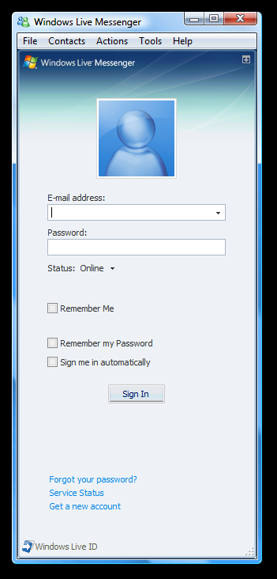

In this lab, we assume that we have the trojan executable file and the
`msnsettings.dat` file from the victim's PC.

Let us see what capabilities are built into this malicious executable. First,
let us introduce the tools and techniques that help with the reverse-engineering
process.

Note that in this example, as with most malicious incidents you will probably
encounter, we examine a compiled Windows executable for which we have no source
code.

## Behavioural analysis

Malware analysis typically starts with behavioural analysis, because it is
easier than code analysis and gives some hints for it. During behavioural
analysis, we infect a laboratory system with the malware. Then we observe how
the malicious executable accesses the file system, the registry, and the
network. As we learn about the program's expectations of its runtime
environment, we slightly adjust our analysis to evoke additional behaviour from
the program. We also interact with the program to discover additional
characteristics it may exhibit.

Let us see this approach in action. Imagine you have a suspicious executable
that you want to analyse. You bring it into your lab, possibly on a removable
USB disk, and place it on the desktop of the virtual machine you are about to
infect. Now what?

> The fake Windows Live Messenger is already copied in your VM image.

First, take a snapshot of the state of the machine's file system and the
registry. This shows you quickly which major changes occurred on the system
after you infect it. To do this we use the free tool called RegShot
(<http://sourceforge.net/projects/regshot>). RegShot is already installed in
your VM. To use it, enable the "Scan dir1" option, and in the corresponding
window type `C:\`. This lets the tool scan the registry and the full C: drive.
Click now "1st shot".

After RegShot takes the first snapshot, launch the malicious executable.
Interact with it a bit (for example, try logging into it). Then kill the
process, if you can. Next, click the "2nd shot" button in RegShot, and click the
"Compare" button. You see a report that describes the major changes to the
system's state. In this case, we see that, among other things, two files were
added to the system.

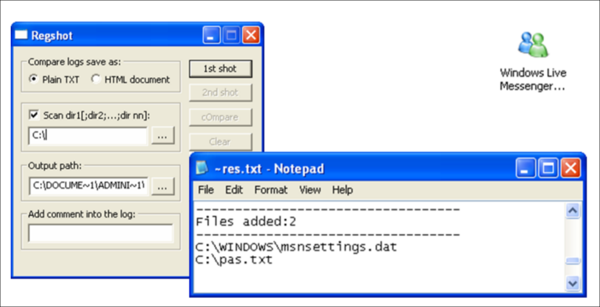

The two files that appeared on the system after we infected it are `pas.txt`
and `msnsettings.dat`. Take a look at them using notepad.

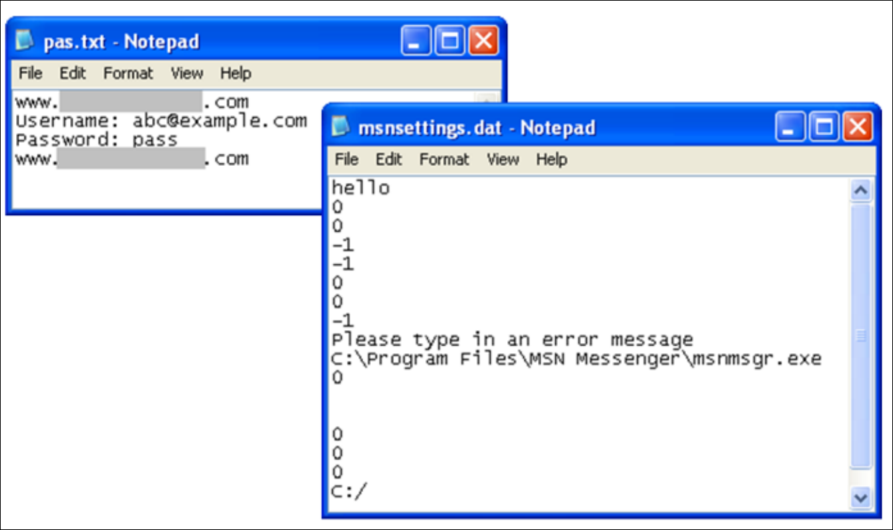

It looks like `pas.txt` captured the login credentials we used when logging
into the malicious executable. That makes sense, because we received reports
that this executable is a trojan copy of Windows Live Messenger.

The `msnsettings.dat` file looks like a configuration file of some sort.

With the obtained information, reverse-engineering the malware can help you at
incident response and forensic analysis. In our scenario, we already discovered
that the Windows Live Messenger trojan uses the `msnsettings.dat` file. Now you
know to look for it on the compromised system, even if you did not initially
realise that this file was important. Once you have a copy of
`msnsettings.dat`, you can open it to see whether it reveals additional details
about the program. It appears like the one in the figure below. It seems
that the malware uses `msnsettings.dat` as a configuration file.

Now, let us take a look at the `msnsettings.dat` inside the
`live-messenger-malware` folder on the desktop. This file comes from the victim
of the fake messenger malware. Let us close the fake messenger and replace the
`msnsettings.dat` in the Windows folder with the victim's one.

In the first line there is a string "test", which we may be able to use later
when trying to understand how the trojan processes the `msnsettings.dat` file.
Another line, `gsmtp185.google.com`, specifies an SMTP mail server. This
suggests that the malware can send email. The file also includes an email
address, `mastercleanex@gmail.com`. This may be the recipient of the
information that the trojan attempts to send out. Of course, these are just
theories at this point. We need to confirm or deny them during the subsequent
analysis steps.

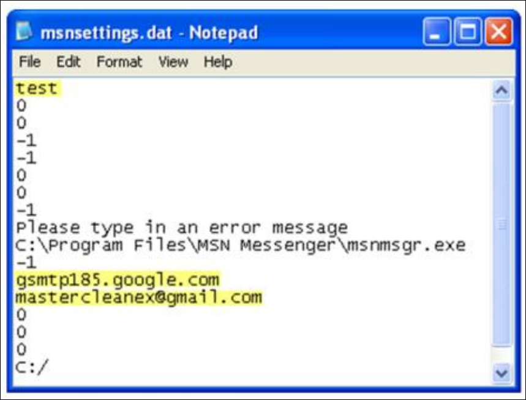

## Network traffic analysis

Our next step is to confirm if the fake Microsoft MSN sends some SMTP messages.
To do this, we use Wireshark. Launch the tool and then execute the malware again
with the victim's `msnsettings.dat`.

> Warning: before you capture network traffic, flush the DNS cache. In the
> Windows command line, run `ipconfig /flushdns`. You can also flush all the
> network related caches from the Control Panel → Network settings → Network
> connections → double click on the network connection, select the Support tab
> and click Repair.

Wireshark is a full-feature network sniffer (<http://www.wireshark.org>). Open
it and run the sniffer over the network interface using the appropriate
filters.

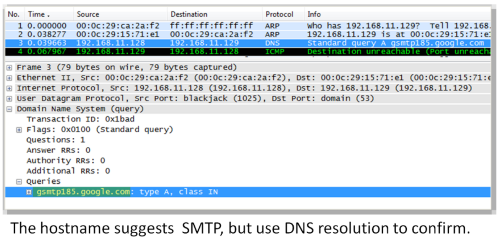

As you can see on the dump, the sniffer shows that the infected system issued a
DNS query to resolve the hostname `gsmtp185.google.com`. The SMTP in the
hostname suggests that the malware looks for a mail server to connect to, which
reinforces our earlier theory of how the trojan might use this hostname.

We therefore try to intercept any email that the fake messenger possibly sends
to that SMTP server. To this end, we:

1. Redirect DNS queries to localhost. You can do this in the properties of the
   Windows Network Connection in the Control Panel. Go to TCP/IP properties and
   set `127.0.0.1` as the primary DNS server.

2. Capture any DNS request with Fake DNS. Fake DNS is a DNS server that you can
   configure to answer any DNS query with a single IP address of your choice.
   Which IP address must you use? The easiest option is to use "localhost"
   again. This redirects any DNS query to localhost. Therefore, a possible
   connection to `gsmtp185.google.com` on port 25 is redirected to
   `localhost:25`. Put Fake DNS to "Listen" mode.

3. Set up an SMTP listener on port 25 to capture any mail that will be sent. An
   easy way to do this is to use the Mailpot tool. Mailpot pretends to be a mail
   server, happily accepting SMTP messages from clients, but not sending them
   out. Instead, it stores the messages locally for your review. To use Mailpot,
   run it on the host to which you redirected the SMTP requests (localhost)
   using Fake DNS and put it to "Listen" mode.

Now that you set up the DNS server as localhost (in Windows network connection
settings), reply to the DNS request with localhost, and listen to the SMTP
connection on port 25, you are ready to try to log in with the fake MSN and see
what happens.

Now you see both the DNS request and response in the Fake DNS window, and
in the Mailpot window there is the email that the fake MSN sent and
Mailpot captured.

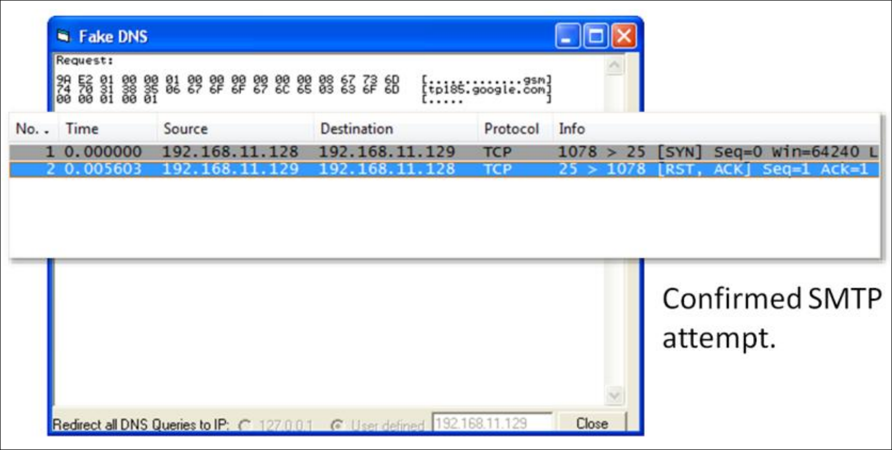

If you open the mail, you can see the contents of the message that the trojan
mails to the attacker.

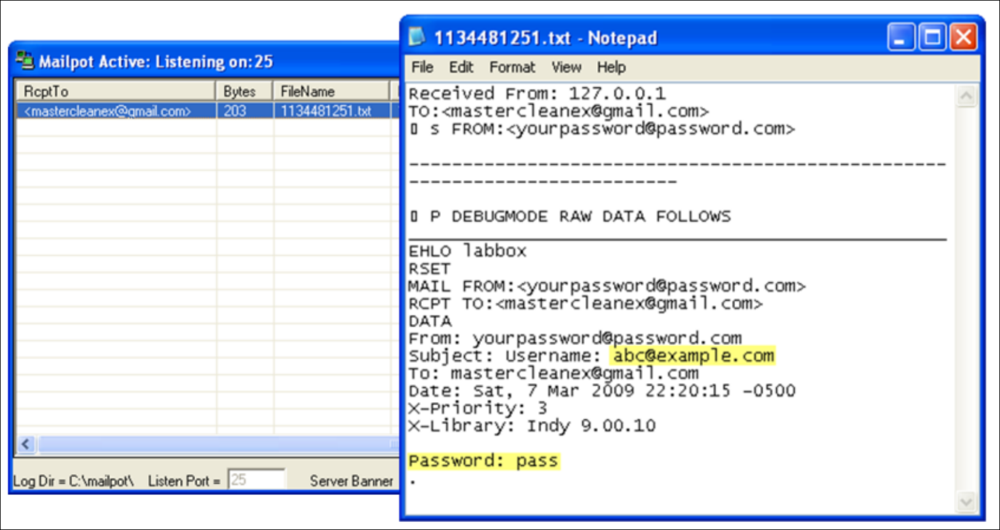

> If the mail does not open (by double clicking on it), you must (1) close
> Mailpot, change the permissions of the `C:\mailpot` folder to writeable
> (remove the tick from "Read-only") and start Mailpot again; you may have to
> repeat this procedure a couple of times; if it does not work yet, you can
> reboot the system and try again (remember to reactivate the Fake DNS).

The message includes the victim's Messenger username and password.

## Code analysis

Behavioural analysis can be insightful and relatively fast. However, it rarely
tells you everything you need to know about malware of moderate and advanced
complexity. That is where code analysis helps. It can reinforce your
behavioural findings and shine a light on additional properties of the malware
that you may not have discovered behaviourally.

Code analysis can be tricky and time-consuming, because in the world of malware
you almost never have the luxury of seeing the source code of the program you
analyse. Instead, you reverse-engineer the compiled executable's functionality
by examining its code at the assembly level. A debugger and a disassembler help
you in this task. A disassembler converts the malware's instructions from their
binary form into the human-readable assembly form. A debugger lets you step
into the most interesting parts of the code, interact with it, and observe the
effects of its instructions to understand their purpose.

We use OllyDbg to perform code analysis. It is free, and includes both a
disassembler and a debugger. You can download OllyDbg from
<http://www.ollydbg.de>.

A good way to start analysing the malware's code often involves looking at the
strings embedded in its executable. To do this with OllyDbg, first load the
malicious executable into OllyDbg via File -> Open. Then, right-click on the
code you see in the disassembler window, and select Search for -> All
referenced text strings.

OllyDbg then brings up a new window that shows the strings it discovered, as you
can see on this slide. Notice that we saw some of these strings during
behavioural analysis! Some of them look like contents of the default
`msnsettings.dat` file that our malware creates when it infects the system.

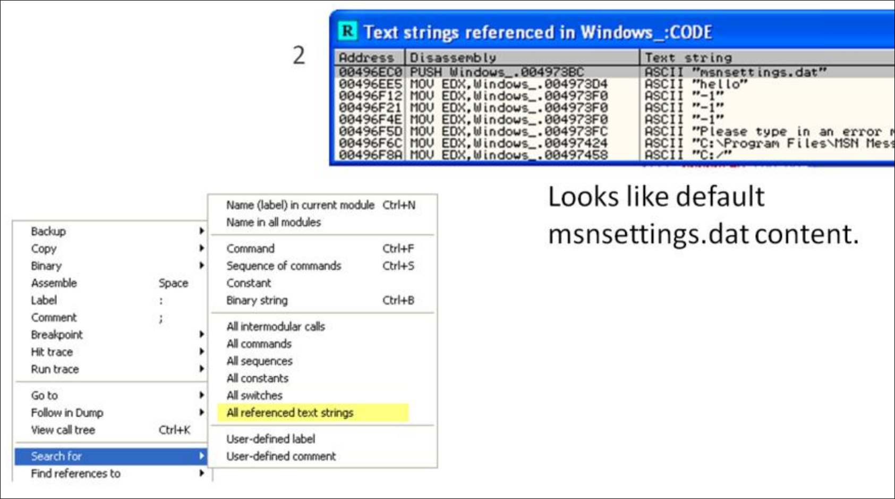

The reason we may be interested in the embedded strings is that the string
listing might include a reference to a malicious characteristic or a behavioural
trait that we want to understand. In this case, consider the following
screenshot. We got here by highlighting one of the instances of `msnsettings.dat`
strings. If you press Enter, OllyDbg shows us how the program uses this string.

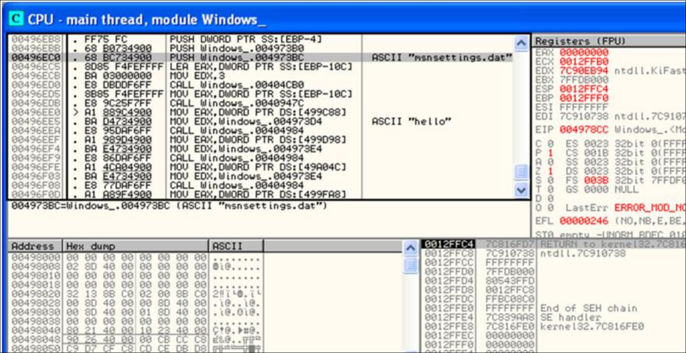

If we wanted to pursue this path of analysis further, we could now set a
breakpoint on this command, run the trojan in the debugger, and see what it
does. But we are not going to investigate this particular aspect of the
malicious program, because we focus on another, more interesting technique.

You may recall that the version of `msnsetting.dat` on the victim's system was
slightly different from the version that the trojan created on our laboratory
system when we first ran it. Specifically, in our case, the file contained the
string "hello", while the victim's version had the string "test" instead. What
is that about?

The string "test" is not visible anywhere in the body of the malicious
executable when it is not running. That is probably because the trojan loads
this string from `msnsettings.dat` during run time. To understand how the trojan
uses the string "test", we search for it in the memory of the running trojan.

Once we locate the string in the trojan's memory (described further), we set an
access breakpoint there. A breakpoint is a condition that tells the debugger
when to pause the normal execution of the debugged program. Once the execution
is paused, the debugger gives us a chance to review the debugged program's run
time environment to understand what it is doing. This is probably the most
useful feature of a debugger in the context of malware reverse engineering.

To use this technique, load the malicious program into OllyDbg, then run it in
the debugger. Once the trojan runs, press "Alt+M" to bring up the memory map in
OllyDbg. This shows the list of the memory segments mapped and used by the
currently debugged executable. To search the executable's memory for a
particular string, select the first line in the Memory Map window, and press
"Ctrl+B". Then enter your string as ASCII text in the dialog box and press
Enter.

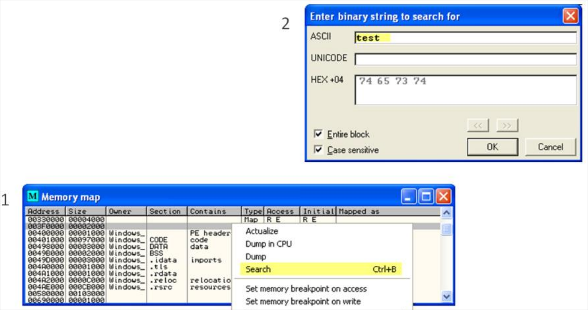

It is possible that your string is in several memory areas. The one you are
interested in is not necessarily the first one. To repeat your search, click on
the memory map window, then press "Ctrl+L" (do not forget to click on the memory
map window).

In the case of our example, we perform the initial search via "Ctrl+B". This
finds us an instance of "test" that is not promising. We repeat the search by
pressing "Ctrl+L" once.

Now that we located the exact string "test" in the trojan's memory, we can set a
breakpoint there. In this case we set a memory access breakpoint, so that
OllyDbg pauses the program's execution whenever it attempts to access this
particular memory area. Effectively, this lets us catch the trojan while it
attempts to use the "test" string. We can then see how it uses the string.

To set the breakpoint, highlight the exact characters of the string "test", then
right-click and click Breakpoint -> Memory, on access.

> This kind of breakpoint does not appear in the list of breakpoints of OllyDbg.

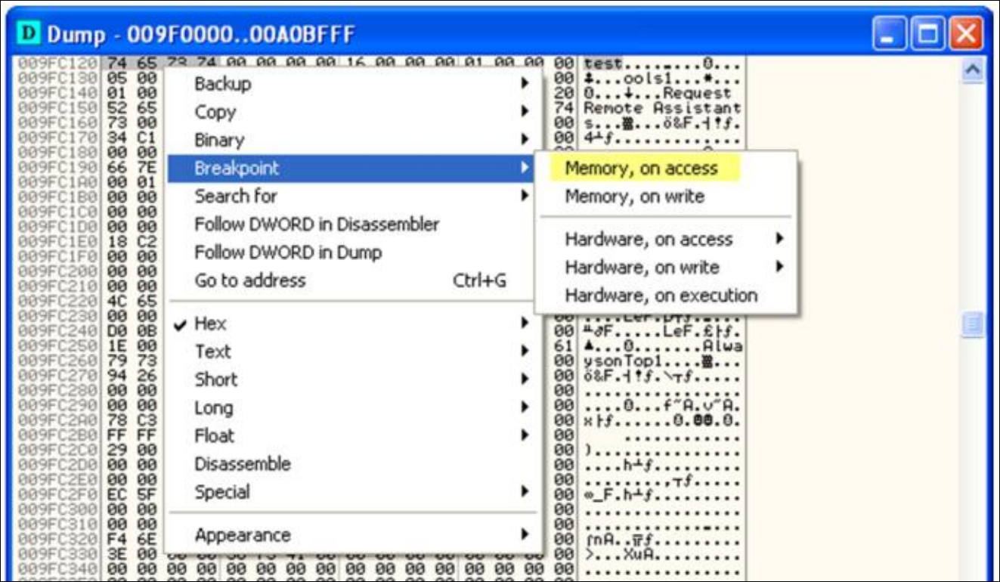

The trojan continues to run. Now we can either wait for it to try using the
string, or interact with the program with the hope that it uses the string. We
can try interacting with the trojan by typing some text into its first field,
the one labeled "E-mail address". If you type any character there after you set
the memory breakpoint, you immediately trigger the breakpoint, as you can see on
the next figure.

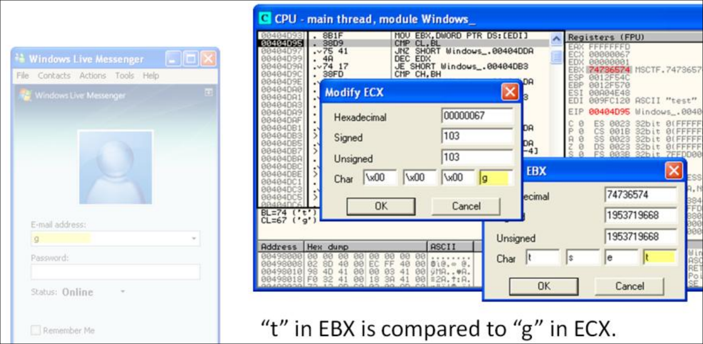

We entered a character into the field (picked a letter at random: "g"). Right
away, OllyDbg comes to the foreground, because we just triggered an attempt by
the trojan to somehow use the string "test". You can now interact with the code,
look at its environment, and even run it as slowly as one instruction at a time.

To execute one instruction, press F8. To examine the run-time environment of the
program, look at its registers in the top right corner of the OllyDbg window. A
register is a specialised and very fast location on the CPU that can store data.

What is going on in this part of the code? Do not worry if you do not understand
much of the assembly code you see there. This is just an introduction to malware
analysis, so we walk you through the most important parts. OllyDbg highlighted
the instruction that will be executed next by the program, "CMP CL, BL". This
compares the contents of two registers, CL and BL. CL points to the lowest byte
of ECX; BL points to the lowest byte of EBX, so it is an efficient way of
comparing parts of the ECX and EBX registers.

Double-click the registers to see their contents. ECX contains the character we
entered, "g". EBX contains the string that our input is compared to, "test" (it
is stored backwards). Press F9 to continue executing the trojan. Delete the "g"
character you entered previously. This time, let the program match the first
character of the "test" string, and see how it compares the second character. To
do this, enter "ta" in the "E-mail address" box. If you keep triggering the
breakpoint, press F9 to continue. You want to pause right after you have a
chance to type "ta".

Press F8 to execute one instruction after you trigger the breakpoint, just like
you did previously. Keep pressing F8 carefully, once at a time, until you reach
"CMP CH, BH" some lines below. This time, if you look at the contents of the ECX
and EBX registers, you see that the trojan compares the character "a" that we
entered to the character "e" that it seems to expect. That is because the CH
register points to the second lowest byte of ECX; the BH register points to the
second lowest byte of EBX.

So, the trojan seems to look for the string "test" in the "E-mail address"
field. Exit the debugger, launch the trojan by itself, and enter "test" to see
what happens.

Voila! When you enter "test", the trojan brings you to a brand new screen that
seems to allow you to configure the trojan's operation. As you can see on this
slide, the configuration options let you define the passphrase to activate this
string, the address where the trojan sends captured login credentials, and so
on.

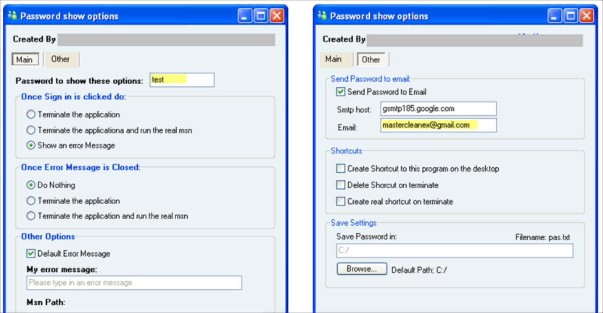

## Deliverables

Submit one file `si-lab4.tar` in Atenea. The archive holds:

- A Wireshark capture of the email send attempt to `smtp.si.fib.upc.edu`.
- The content of the email that Mailpot captured.
- The search for the word "test" in OllyDbg.
  - The word has multiple occurrences.
  - Find the occurrence that activates the configuration menu.
    Compare the memory address with the example screenshot.
- The configuration screen that you open at the end. Show the Main tab only.
